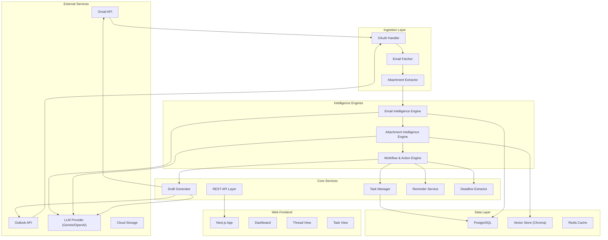
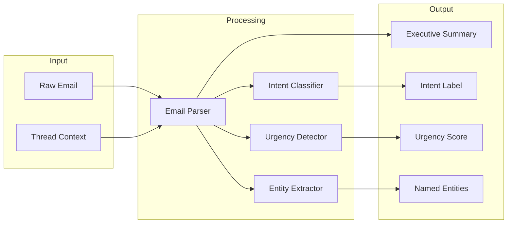
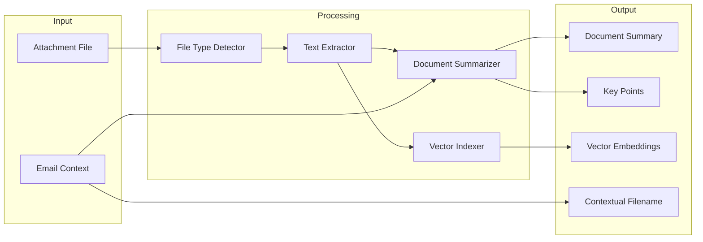
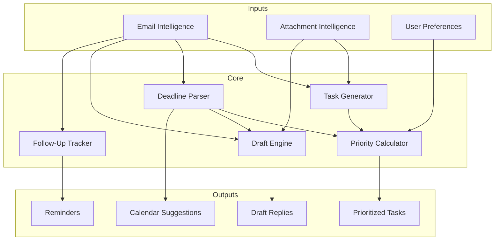
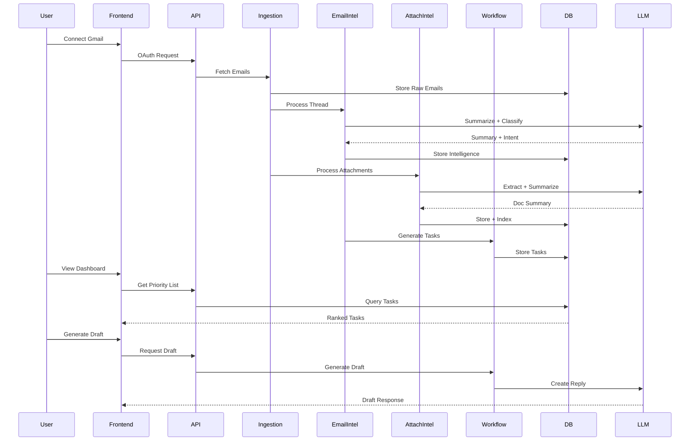

# SortMail — System Architecture

> AI Intelligence Layer for Gmail & Outlook

---

## High-Level Architecture



---

## Engine Architecture

### 1. Email Intelligence Engine



**Responsibilities:**
- Parse email threads into structured data
- Classify intent: `ACTION_REQUIRED` | `FYI` | `SCHEDULING` | `URGENT`
- Extract urgency signals and deadlines
- Generate executive-style briefings

---

### 2. Attachment Intelligence Engine



**Supported Formats (v1):** PDF, DOCX, PPTX

**Responsibilities:**
- Extract text from documents
- Generate summaries and key points
- Create contextual filenames
- Index for RAG retrieval

---

### 3. Workflow & Action Engine



**Responsibilities:**
- Convert emails → actionable tasks
- Score priority with explainability
- Extract deadlines and suggest calendar events
- Generate contextual draft replies
- Track follow-ups and waiting threads

---

## Data Flow



---

## Tech Stack

| Layer | Technology | Rationale |
|-------|------------|-----------|
| **Backend** | Python (FastAPI) | Rapid development, LLM ecosystem |
| **Frontend** | Next.js 14 | SSR, App Router, great DX |
| **Database** | PostgreSQL | Reliable, JSONB support |
| **Vector DB** | Chroma | Simple, embedded, good for MVP |
| **Cache** | Redis | Sessions, rate limiting |
| **Auth** | OAuth 2.0 | Gmail/Outlook native |
| **LLM** | Gemini / OpenAI | Summarization, classification |
| **Styling** | Tailwind + shadcn/ui | Fast, consistent UI |
| **Deployment** | Docker + Railway/Fly.io | Simple, scalable |

---

## API Contracts

### Core Endpoints

```
POST   /api/auth/google          # OAuth flow
POST   /api/auth/outlook         # OAuth flow
GET    /api/emails               # List emails
GET    /api/emails/:id           # Get email details
GET    /api/threads/:id          # Get thread with summary
GET    /api/tasks                # Get prioritized tasks
PATCH  /api/tasks/:id            # Update task status
POST   /api/drafts               # Generate draft reply
GET    /api/reminders            # Get pending reminders
POST   /api/calendar/suggest     # Suggest calendar event
```

---

## Security Considerations

| Concern | Mitigation |
|---------|------------|
| Token Storage | Encrypted at rest, short-lived access tokens |
| Data Privacy | User data isolated, no cross-tenant access |
| LLM Data | No training on user data, minimal context |
| API Security | Rate limiting, JWT auth, CORS |
| Attachments | Virus scan before processing |
