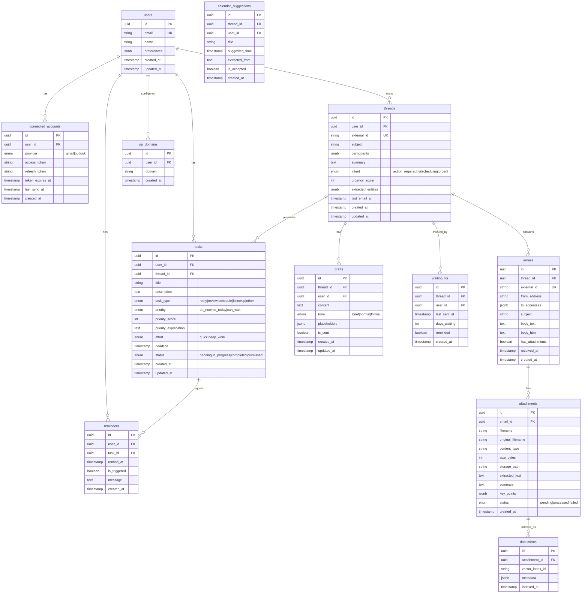

# SortMail — Database Schema

---

## Entity Relationship Diagram



---

## SQL Schema

```sql
-- Extensions
CREATE EXTENSION IF NOT EXISTS "uuid-ossp";
CREATE EXTENSION IF NOT EXISTS "pg_trgm";

-- Enums
CREATE TYPE provider_type AS ENUM ('gmail', 'outlook');
CREATE TYPE intent_type AS ENUM ('action_required', 'fyi', 'scheduling', 'urgent');
CREATE TYPE task_type AS ENUM ('reply', 'review', 'schedule', 'followup', 'other');
CREATE TYPE priority_level AS ENUM ('do_now', 'do_today', 'can_wait');
CREATE TYPE effort_level AS ENUM ('quick', 'deep_work');
CREATE TYPE task_status AS ENUM ('pending', 'in_progress', 'completed', 'dismissed');
CREATE TYPE attachment_status AS ENUM ('pending', 'processed', 'failed');
CREATE TYPE tone_type AS ENUM ('brief', 'normal', 'formal');

-- Users
CREATE TABLE users (
    id UUID PRIMARY KEY DEFAULT uuid_generate_v4(),
    email VARCHAR(255) UNIQUE NOT NULL,
    name VARCHAR(255),
    preferences JSONB DEFAULT '{}',
    created_at TIMESTAMP DEFAULT NOW(),
    updated_at TIMESTAMP DEFAULT NOW()
);

-- Connected Accounts
CREATE TABLE connected_accounts (
    id UUID PRIMARY KEY DEFAULT uuid_generate_v4(),
    user_id UUID NOT NULL REFERENCES users(id) ON DELETE CASCADE,
    provider provider_type NOT NULL,
    access_token TEXT NOT NULL,
    refresh_token TEXT,
    token_expires_at TIMESTAMP,
    last_sync_at TIMESTAMP,
    created_at TIMESTAMP DEFAULT NOW(),
    UNIQUE(user_id, provider)
);

-- Threads
CREATE TABLE threads (
    id UUID PRIMARY KEY DEFAULT uuid_generate_v4(),
    user_id UUID NOT NULL REFERENCES users(id) ON DELETE CASCADE,
    external_id VARCHAR(255) UNIQUE NOT NULL,
    subject TEXT,
    participants JSONB DEFAULT '[]',
    summary TEXT,
    intent intent_type,
    urgency_score INTEGER DEFAULT 0,
    extracted_entities JSONB DEFAULT '{}',
    last_email_at TIMESTAMP,
    created_at TIMESTAMP DEFAULT NOW(),
    updated_at TIMESTAMP DEFAULT NOW()
);

-- Emails
CREATE TABLE emails (
    id UUID PRIMARY KEY DEFAULT uuid_generate_v4(),
    thread_id UUID NOT NULL REFERENCES threads(id) ON DELETE CASCADE,
    external_id VARCHAR(255) UNIQUE NOT NULL,
    from_address VARCHAR(255) NOT NULL,
    to_addresses JSONB DEFAULT '[]',
    subject TEXT,
    body_text TEXT,
    body_html TEXT,
    has_attachments BOOLEAN DEFAULT FALSE,
    received_at TIMESTAMP NOT NULL,
    created_at TIMESTAMP DEFAULT NOW()
);

-- Attachments
CREATE TABLE attachments (
    id UUID PRIMARY KEY DEFAULT uuid_generate_v4(),
    email_id UUID NOT NULL REFERENCES emails(id) ON DELETE CASCADE,
    filename VARCHAR(512) NOT NULL,
    original_filename VARCHAR(512) NOT NULL,
    content_type VARCHAR(255),
    size_bytes INTEGER,
    storage_path TEXT,
    extracted_text TEXT,
    summary TEXT,
    key_points JSONB DEFAULT '[]',
    status attachment_status DEFAULT 'pending',
    created_at TIMESTAMP DEFAULT NOW()
);

-- Documents (Vector Index Reference)
CREATE TABLE documents (
    id UUID PRIMARY KEY DEFAULT uuid_generate_v4(),
    attachment_id UUID UNIQUE NOT NULL REFERENCES attachments(id) ON DELETE CASCADE,
    vector_index_id VARCHAR(255) NOT NULL,
    metadata JSONB DEFAULT '{}',
    indexed_at TIMESTAMP DEFAULT NOW()
);

-- Tasks
CREATE TABLE tasks (
    id UUID PRIMARY KEY DEFAULT uuid_generate_v4(),
    user_id UUID NOT NULL REFERENCES users(id) ON DELETE CASCADE,
    thread_id UUID REFERENCES threads(id) ON DELETE SET NULL,
    title VARCHAR(512) NOT NULL,
    description TEXT,
    task_type task_type DEFAULT 'other',
    priority priority_level DEFAULT 'can_wait',
    priority_score INTEGER DEFAULT 0,
    priority_explanation TEXT,
    effort effort_level DEFAULT 'quick',
    deadline TIMESTAMP,
    status task_status DEFAULT 'pending',
    created_at TIMESTAMP DEFAULT NOW(),
    updated_at TIMESTAMP DEFAULT NOW()
);

-- Drafts
CREATE TABLE drafts (
    id UUID PRIMARY KEY DEFAULT uuid_generate_v4(),
    thread_id UUID NOT NULL REFERENCES threads(id) ON DELETE CASCADE,
    user_id UUID NOT NULL REFERENCES users(id) ON DELETE CASCADE,
    content TEXT NOT NULL,
    tone tone_type DEFAULT 'normal',
    placeholders JSONB DEFAULT '[]',
    is_sent BOOLEAN DEFAULT FALSE,
    created_at TIMESTAMP DEFAULT NOW(),
    updated_at TIMESTAMP DEFAULT NOW()
);

-- Waiting For (Follow-up Tracking)
CREATE TABLE waiting_for (
    id UUID PRIMARY KEY DEFAULT uuid_generate_v4(),
    thread_id UUID NOT NULL REFERENCES threads(id) ON DELETE CASCADE,
    user_id UUID NOT NULL REFERENCES users(id) ON DELETE CASCADE,
    last_sent_at TIMESTAMP NOT NULL,
    days_waiting INTEGER DEFAULT 0,
    reminded BOOLEAN DEFAULT FALSE,
    created_at TIMESTAMP DEFAULT NOW(),
    UNIQUE(thread_id, user_id)
);

-- Reminders
CREATE TABLE reminders (
    id UUID PRIMARY KEY DEFAULT uuid_generate_v4(),
    user_id UUID NOT NULL REFERENCES users(id) ON DELETE CASCADE,
    task_id UUID REFERENCES tasks(id) ON DELETE CASCADE,
    remind_at TIMESTAMP NOT NULL,
    is_triggered BOOLEAN DEFAULT FALSE,
    message TEXT,
    created_at TIMESTAMP DEFAULT NOW()
);

-- VIP Domains
CREATE TABLE vip_domains (
    id UUID PRIMARY KEY DEFAULT uuid_generate_v4(),
    user_id UUID NOT NULL REFERENCES users(id) ON DELETE CASCADE,
    domain VARCHAR(255) NOT NULL,
    created_at TIMESTAMP DEFAULT NOW(),
    UNIQUE(user_id, domain)
);

-- Calendar Suggestions
CREATE TABLE calendar_suggestions (
    id UUID PRIMARY KEY DEFAULT uuid_generate_v4(),
    thread_id UUID NOT NULL REFERENCES threads(id) ON DELETE CASCADE,
    user_id UUID NOT NULL REFERENCES users(id) ON DELETE CASCADE,
    title VARCHAR(512) NOT NULL,
    suggested_time TIMESTAMP,
    extracted_from TEXT,
    is_accepted BOOLEAN DEFAULT FALSE,
    created_at TIMESTAMP DEFAULT NOW()
);

-- Indexes
CREATE INDEX idx_threads_user_id ON threads(user_id);
CREATE INDEX idx_threads_last_email_at ON threads(last_email_at DESC);
CREATE INDEX idx_emails_thread_id ON emails(thread_id);
CREATE INDEX idx_emails_received_at ON emails(received_at DESC);
CREATE INDEX idx_attachments_email_id ON attachments(email_id);
CREATE INDEX idx_tasks_user_id ON tasks(user_id);
CREATE INDEX idx_tasks_status ON tasks(status);
CREATE INDEX idx_tasks_priority ON tasks(priority_score DESC);
CREATE INDEX idx_tasks_deadline ON tasks(deadline);
CREATE INDEX idx_waiting_for_user_id ON waiting_for(user_id);
CREATE INDEX idx_reminders_remind_at ON reminders(remind_at);
CREATE INDEX idx_reminders_user_id ON reminders(user_id);

-- Full-text search on emails
CREATE INDEX idx_emails_body_search ON emails USING gin(to_tsvector('english', body_text));
```

---

## Key Design Decisions

| Decision | Rationale |
|----------|-----------|
| UUID Primary Keys | Distributed-friendly, no sequential leakage |
| JSONB for Flexible Data | Participants, entities, preferences |
| Separate Documents Table | Clean separation from attachment metadata |
| Soft Priority + Score | Human-readable + sortable |
| External ID Fields | Sync with Gmail/Outlook IDs |
| Cascade Deletes | Clean orphan management |
