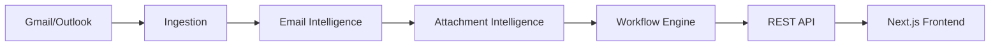

# SortMail — Implementation Plan

> AI Intelligence Layer for Gmail & Outlook

---

## Overview

SortMail is a web-based AI SaaS that acts as an intelligence layer on top of Gmail and Outlook. It summarizes threads, understands attachments, converts emails into prioritized tasks, tracks follow-ups, and drafts contextual replies.

**Scope**: MVP focused on core intelligence and decision-making — not a full email client replacement.

---

## Documentation Index

| Document | Description |
|----------|-------------|
| [architecture.md](file:///C:/Users/Asus/.gemini/antigravity/brain/29db4a15-1964-441e-8275-3fbc526779ca/architecture.md) | System architecture, engine diagrams, data flow, tech stack |
| [database_schema.md](file:///C:/Users/Asus/.gemini/antigravity/brain/29db4a15-1964-441e-8275-3fbc526779ca/database_schema.md) | ERD diagram, full SQL schema, design decisions |
| [repo_structure.md](file:///C:/Users/Asus/.gemini/antigravity/brain/29db4a15-1964-441e-8275-3fbc526779ca/repo_structure.md) | Monorepo layout, CI/CD, Docker, branching strategy |
| [ui_ux_spec.md](file:///C:/Users/Asus/.gemini/antigravity/brain/29db4a15-1964-441e-8275-3fbc526779ca/ui_ux_spec.md) | Wireframes, component hierarchy, design tokens |
| [sprint_plan.md](file:///C:/Users/Asus/.gemini/antigravity/brain/29db4a15-1964-441e-8275-3fbc526779ca/sprint_plan.md) | 7-day execution plan, team assignments, milestones |

---

## Architecture Summary

**Three Core Engines:**
1. **Email Intelligence** — Summarization, intent classification, urgency detection
2. **Attachment Intelligence** — Document extraction, summarization, RAG indexing
3. **Workflow Engine** — Task generation, priority scoring, draft replies, reminders

---

## Tech Stack Summary

| Layer | Technology |
|-------|------------|
| Backend | Python (FastAPI) |
| Frontend | Next.js 14 + Tailwind + shadcn/ui |
| Database | PostgreSQL |
| Vector DB | Chroma |
| LLM | Gemini / OpenAI |
| Auth | OAuth 2.0 (Google, Microsoft) |
| Deploy | Docker + Railway/Fly.io |

---

## Key Features (MVP)

| Feature | Module | Priority |
|---------|--------|----------|
| Email Thread Summarization | Email Intel | P0 |
| Intent Classification | Email Intel | P0 |
| Attachment Summarization | Attach Intel | P1 |
| Task Generation | Workflow | P0 |
| Priority Scoring | Workflow | P0 |
| Smart Deadline Extraction | Workflow | P1 |
| Draft Reply Generation | Workflow | P0 |
| Follow-up Tracking | Workflow | P1 |
| Calendar Suggestions | Workflow | P2 |

---

## Schema Summary

**Core Tables:**
- `users`, `connected_accounts`
- `threads`, `emails`, `attachments`, `documents`
- `tasks`, `drafts`, `waiting_for`, `reminders`
- `vip_domains`, `calendar_suggestions`

See [database_schema.md](file:///C:/Users/Asus/.gemini/antigravity/brain/29db4a15-1964-441e-8275-3fbc526779ca/database_schema.md) for full ERD and SQL.

---

## UI Screens

1. **Login / Connect** — OAuth flow for Gmail/Outlook
2. **Dashboard** — Priority tasks, waiting-for list, quick stats
3. **Thread View** — Summary, attachments, actions, draft panel
4. **Task List** — Do Now / Do Today / Can Wait sections
5. **Settings** — VIP domains, preferences

See [ui_ux_spec.md](file:///C:/Users/Asus/.gemini/antigravity/brain/29db4a15-1964-441e-8275-3fbc526779ca/ui_ux_spec.md) for wireframes and component hierarchy.

---

## Sprint Plan Summary

### Week 1 Goals

| Day | Focus |
|-----|-------|
| 1 | Repo setup, CI/CD, Docker |
| 2 | OAuth, authentication |
| 3 | Email ingestion |
| 4 | Intelligence engine |
| 5 | Task + draft engine |
| 6 | Integration, polish |
| 7 | Demo-ready MVP |

See [sprint_plan.md](file:///C:/Users/Asus/.gemini/antigravity/brain/29db4a15-1964-441e-8275-3fbc526779ca/sprint_plan.md) for detailed daily breakdown.

---

## Definition of Done (Week 1)

- [ ] User can login with Google OAuth
- [ ] Emails fetched and stored
- [ ] Thread summaries generated
- [ ] Emails classified by intent
- [ ] Tasks auto-generated with priority
- [ ] Draft replies generated with tone options
- [ ] Dashboard shows priority list
- [ ] Thread view shows summary + attachments
- [ ] End-to-end demo flow works

---

## Engineering Principles

| Principle | Rationale |
|-----------|-----------|
| **MVP first** | Ship fast, iterate |
| **No auto-actions** | Never send emails or book calendar automatically |
| **Explainable AI** | Show why priority is high |
| **User trust** | No hidden automation |
| **Clean interfaces** | Each engine works independently |

---

## Out of Scope (v1)

- Full email client replacement
- Automatic email sending
- Calendar automation
- Team workflows / CRM
- Mobile apps
- Multi-tenant billing

---

## Next Steps

1. **Review and approve** this architecture plan
2. **Set up repository** per [repo_structure.md](file:///C:/Users/Asus/.gemini/antigravity/brain/29db4a15-1964-441e-8275-3fbc526779ca/repo_structure.md)
3. **Assign team members** per [sprint_plan.md](file:///C:/Users/Asus/.gemini/antigravity/brain/29db4a15-1964-441e-8275-3fbc526779ca/sprint_plan.md)
4. **Start Figma wireframes** per [ui_ux_spec.md](file:///C:/Users/Asus/.gemini/antigravity/brain/29db4a15-1964-441e-8275-3fbc526779ca/ui_ux_spec.md)
5. **Begin Day 1 execution**
