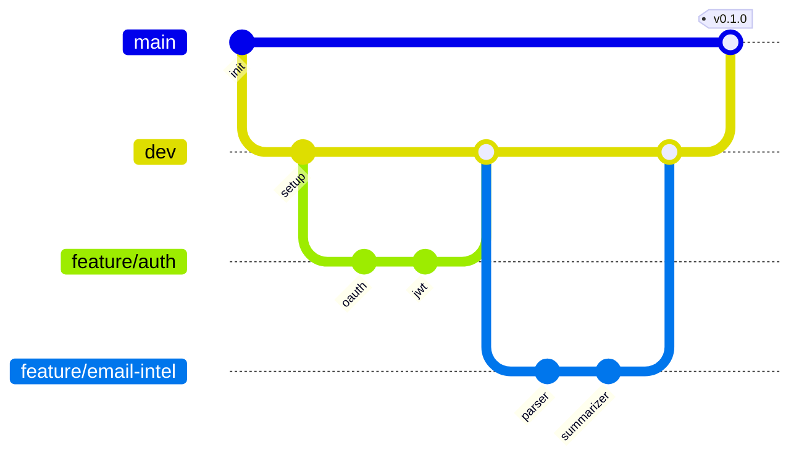

# SortMail — Repository Structure

---

## Monorepo Layout

```
sortmail/
├── .github/
│   └── workflows/
│       ├── ci.yml                 # Lint, test, build
│       ├── deploy-staging.yml     # Auto-deploy to staging
│       └── deploy-prod.yml        # Manual prod deploy
│
├── backend/
│   ├── app/
│   │   ├── __init__.py
│   │   ├── main.py                # FastAPI app entry
│   │   ├── config.py              # Environment config
│   │   └── dependencies.py        # DI setup
│   │
│   ├── api/
│   │   ├── __init__.py
│   │   ├── routes/
│   │   │   ├── auth.py            # OAuth endpoints
│   │   │   ├── emails.py          # Email endpoints
│   │   │   ├── threads.py         # Thread endpoints
│   │   │   ├── tasks.py           # Task endpoints
│   │   │   ├── drafts.py          # Draft endpoints
│   │   │   └── reminders.py       # Reminder endpoints
│   │   └── middleware/
│   │       ├── auth.py            # JWT validation
│   │       └── rate_limit.py      # Rate limiting
│   │
│   ├── core/
│   │   ├── __init__.py
│   │   ├── auth/
│   │   │   ├── oauth_google.py    # Google OAuth
│   │   │   ├── oauth_microsoft.py # Microsoft OAuth
│   │   │   └── jwt.py             # Token management
│   │   │
│   │   ├── ingestion/
│   │   │   ├── gmail_client.py    # Gmail API client
│   │   │   ├── outlook_client.py  # Outlook API client
│   │   │   ├── email_fetcher.py   # Email sync logic
│   │   │   └── attachment_extractor.py
│   │   │
│   │   ├── intelligence/
│   │   │   ├── email_intel.py     # Email Intelligence Engine
│   │   │   ├── attachment_intel.py # Attachment Intelligence
│   │   │   ├── summarizer.py      # LLM summarization
│   │   │   ├── intent_classifier.py
│   │   │   ├── deadline_extractor.py
│   │   │   └── entity_extractor.py
│   │   │
│   │   ├── workflow/
│   │   │   ├── task_generator.py  # Task creation logic
│   │   │   ├── priority_engine.py # Priority scoring
│   │   │   ├── draft_engine.py    # Draft generation
│   │   │   ├── followup_tracker.py
│   │   │   └── reminder_service.py
│   │   │
│   │   └── storage/
│   │       ├── database.py        # DB connection
│   │       ├── vector_store.py    # Chroma client
│   │       └── file_storage.py    # Cloud storage
│   │
│   ├── models/
│   │   ├── __init__.py
│   │   ├── user.py
│   │   ├── email.py
│   │   ├── thread.py
│   │   ├── task.py
│   │   ├── attachment.py
│   │   └── draft.py
│   │
│   ├── schemas/
│   │   ├── __init__.py
│   │   ├── auth.py                # Auth request/response
│   │   ├── email.py
│   │   ├── task.py
│   │   └── draft.py
│   │
│   ├── tests/
│   │   ├── __init__.py
│   │   ├── conftest.py
│   │   ├── test_auth.py
│   │   ├── test_email_intel.py
│   │   ├── test_task_engine.py
│   │   └── test_draft_engine.py
│   │
│   ├── alembic/                   # DB migrations
│   │   ├── versions/
│   │   └── env.py
│   │
│   ├── requirements.txt
│   ├── requirements-dev.txt
│   ├── Dockerfile
│   └── pyproject.toml
│
├── frontend/
│   ├── src/
│   │   ├── app/
│   │   │   ├── layout.tsx
│   │   │   ├── page.tsx           # Landing
│   │   │   ├── login/
│   │   │   ├── dashboard/
│   │   │   │   ├── page.tsx
│   │   │   │   └── layout.tsx
│   │   │   ├── thread/
│   │   │   │   └── [id]/
│   │   │   ├── tasks/
│   │   │   └── settings/
│   │   │
│   │   ├── components/
│   │   │   ├── ui/                # shadcn components
│   │   │   ├── layout/
│   │   │   │   ├── Sidebar.tsx
│   │   │   │   ├── Header.tsx
│   │   │   │   └── Footer.tsx
│   │   │   ├── dashboard/
│   │   │   │   ├── PriorityList.tsx
│   │   │   │   ├── WaitingFor.tsx
│   │   │   │   └── QuickStats.tsx
│   │   │   ├── thread/
│   │   │   │   ├── ThreadSummary.tsx
│   │   │   │   ├── AttachmentCard.tsx
│   │   │   │   └── DraftPanel.tsx
│   │   │   └── task/
│   │   │       ├── TaskCard.tsx
│   │   │       └── TaskList.tsx
│   │   │
│   │   ├── lib/
│   │   │   ├── api.ts             # API client
│   │   │   ├── auth.ts            # Auth utilities
│   │   │   └── utils.ts
│   │   │
│   │   ├── hooks/
│   │   │   ├── useAuth.ts
│   │   │   ├── useTasks.ts
│   │   │   └── useThreads.ts
│   │   │
│   │   ├── types/
│   │   │   ├── email.ts
│   │   │   ├── task.ts
│   │   │   └── user.ts
│   │   │
│   │   └── styles/
│   │       └── globals.css
│   │
│   ├── public/
│   ├── package.json
│   ├── tailwind.config.ts
│   ├── tsconfig.json
│   ├── next.config.js
│   └── Dockerfile
│
├── docs/
│   ├── architecture.md
│   ├── api-reference.md
│   └── setup.md
│
├── scripts/
│   ├── setup-dev.sh
│   ├── seed-data.py
│   └── run-migrations.sh
│
├── docker-compose.yml
├── docker-compose.dev.yml
├── .env.example
├── .gitignore
├── README.md
└── Makefile
```

---

## CI/CD Workflow

```yaml
# .github/workflows/ci.yml
name: CI

on:
  push:
    branches: [main, dev]
  pull_request:
    branches: [main, dev]

jobs:
  backend:
    runs-on: ubuntu-latest
    steps:
      - uses: actions/checkout@v4
      - uses: actions/setup-python@v5
        with:
          python-version: '3.11'
      - run: pip install -r backend/requirements-dev.txt
      - run: cd backend && ruff check .
      - run: cd backend && pytest

  frontend:
    runs-on: ubuntu-latest
    steps:
      - uses: actions/checkout@v4
      - uses: actions/setup-node@v4
        with:
          node-version: '20'
      - run: cd frontend && npm ci
      - run: cd frontend && npm run lint
      - run: cd frontend && npm run build
```

---

## Branching Strategy



**Rules:**
- `main` — Production-ready only
- `dev` — Integration branch
- `feature/*` — Individual features
- No direct push to `main`
- All PRs require 1 approval
- CI must pass before merge

---

## Docker Setup

```yaml
# docker-compose.dev.yml
version: '3.8'

services:
  backend:
    build: ./backend
    ports:
      - "8000:8000"
    volumes:
      - ./backend:/app
    environment:
      - DATABASE_URL=postgresql://postgres:postgres@db:5432/sortmail
      - REDIS_URL=redis://redis:6379
    depends_on:
      - db
      - redis

  frontend:
    build: ./frontend
    ports:
      - "3000:3000"
    volumes:
      - ./frontend:/app
    environment:
      - NEXT_PUBLIC_API_URL=http://localhost:8000

  db:
    image: postgres:15
    environment:
      - POSTGRES_DB=sortmail
      - POSTGRES_PASSWORD=postgres
    volumes:
      - postgres_data:/var/lib/postgresql/data
    ports:
      - "5432:5432"

  redis:
    image: redis:7-alpine
    ports:
      - "6379:6379"

  chroma:
    image: chromadb/chroma:latest
    ports:
      - "8001:8000"
    volumes:
      - chroma_data:/chroma/chroma

volumes:
  postgres_data:
  chroma_data:
```

---

## Makefile Commands

```makefile
.PHONY: dev setup test lint migrate

dev:
	docker-compose -f docker-compose.dev.yml up

setup:
	cd backend && pip install -r requirements-dev.txt
	cd frontend && npm install

test:
	cd backend && pytest
	cd frontend && npm test

lint:
	cd backend && ruff check .
	cd frontend && npm run lint

migrate:
	cd backend && alembic upgrade head

seed:
	cd backend && python scripts/seed-data.py
```
