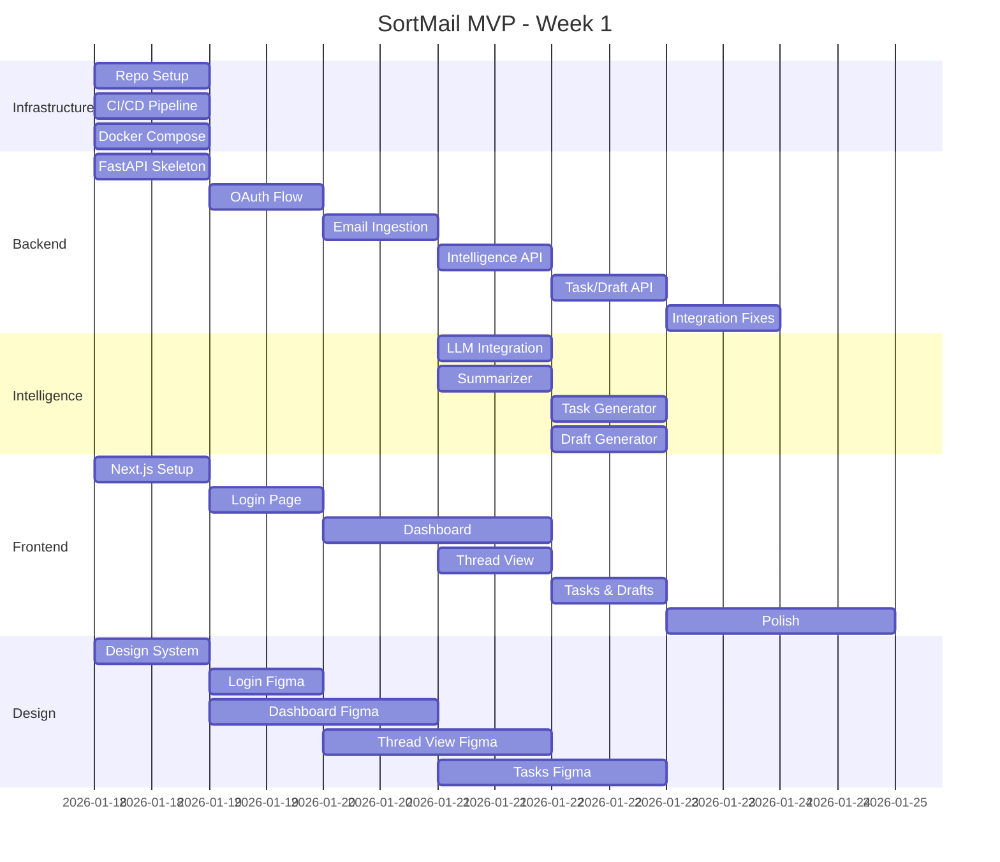

# SortMail — Sprint Plan (Week 1)

---

## Team Structure

| Role | Responsibilities |
|------|------------------|
| **Tech Lead / DevOps** (You) | Architecture, CI/CD, integration, reviews |
| **Backend Core** | Auth, DB, APIs, email ingestion |
| **Intelligence Team** | LLM integration, summarization, classification |
| **Frontend Team** | UI components, API integration, UX |
| **Design** | Figma wireframes, design system |

---

## 7-Day Execution Plan

### Day 1 — Foundation
```
┌────────────────────────────────────────────────────────────────────┐
│ GOAL: Repository and infrastructure ready                         │
├────────────────────────────────────────────────────────────────────┤
│                                                                    │
│ Tech Lead:                                                         │
│   ☐ Create monorepo structure                                      │
│   ☐ Set up GitHub Actions CI pipeline                              │
│   ☐ Configure Docker Compose for local dev                         │
│   ☐ Set up Postgres + Redis + Chroma containers                    │
│   ☐ Create .env.example and document setup                         │
│                                                                    │
│ Backend:                                                           │
│   ☐ Initialize FastAPI project skeleton                            │
│   ☐ Set up Alembic for migrations                                  │
│   ☐ Create initial DB schema migration                             │
│                                                                    │
│ Frontend:                                                          │
│   ☐ Initialize Next.js 14 with App Router                          │
│   ☐ Set up Tailwind + shadcn/ui                                    │
│   ☐ Create basic layout components                                 │
│                                                                    │
│ Design:                                                            │
│   ☐ Start Figma project                                            │
│   ☐ Define color palette and tokens                                │
│                                                                    │
└────────────────────────────────────────────────────────────────────┘
```

---

### Day 2 — Authentication
```
┌────────────────────────────────────────────────────────────────────┐
│ GOAL: OAuth flow working for Gmail (mock OK for MVP)              │
├────────────────────────────────────────────────────────────────────┤
│                                                                    │
│ Tech Lead:                                                         │
│   ☐ Review PRs, ensure CI passing                                  │
│   ☐ Set up staging environment                                     │
│                                                                    │
│ Backend:                                                           │
│   ☐ Implement Google OAuth flow                                    │
│   ☐ JWT token generation and validation                            │
│   ☐ User creation on first login                                   │
│   ☐ Store connected_accounts with tokens                           │
│   ☐ Write auth middleware                                          │
│                                                                    │
│ Frontend:                                                          │
│   ☐ Create Login page                                              │
│   ☐ Implement OAuth redirect flow                                  │
│   ☐ Store JWT in httpOnly cookie or secure storage                 │
│   ☐ Protected route wrapper                                        │
│                                                                    │
│ Design:                                                            │
│   ☐ Complete Login screen in Figma                                 │
│   ☐ Start Dashboard wireframes                                     │
│                                                                    │
└────────────────────────────────────────────────────────────────────┘
```

---

### Day 3 — Email Ingestion
```
┌────────────────────────────────────────────────────────────────────┐
│ GOAL: Fetch and store emails from Gmail                           │
├────────────────────────────────────────────────────────────────────┤
│                                                                    │
│ Backend:                                                           │
│   ☐ Gmail API client wrapper                                       │
│   ☐ Email fetcher service                                          │
│   ☐ Thread grouping logic                                          │
│   ☐ Store emails and threads in DB                                 │
│   ☐ Attachment detection and metadata storage                      │
│                                                                    │
│ Frontend:                                                          │
│   ☐ Dashboard layout shell                                         │
│   ☐ Sidebar navigation                                             │
│   ☐ Basic email list component (mock data OK)                      │
│                                                                    │
│ Design:                                                            │
│   ☐ Complete Dashboard in Figma                                    │
│   ☐ Start Thread View wireframes                                   │
│                                                                    │
└────────────────────────────────────────────────────────────────────┘
```

---

### Day 4 — Intelligence Engine
```
┌────────────────────────────────────────────────────────────────────┐
│ GOAL: Email summarization and intent classification working       │
├────────────────────────────────────────────────────────────────────┤
│                                                                    │
│ Intelligence:                                                      │
│   ☐ LLM integration (Gemini or OpenAI)                             │
│   ☐ Email summarizer prompt engineering                            │
│   ☐ Intent classifier (action_required, fyi, scheduling, urgent)  │
│   ☐ Urgency scoring logic                                          │
│   ☐ Deadline extractor (regex + LLM hybrid)                        │
│                                                                    │
│ Backend:                                                           │
│   ☐ Integrate Email Intelligence Engine                            │
│   ☐ API endpoint: GET /threads/:id with summary                    │
│   ☐ Store summaries and intents in threads table                   │
│                                                                    │
│ Frontend:                                                          │
│   ☐ Thread view page structure                                     │
│   ☐ Executive summary component                                    │
│   ☐ Connect to real API                                            │
│                                                                    │
│ Design:                                                            │
│   ☐ Complete Thread View in Figma                                  │
│   ☐ Start Task List wireframes                                     │
│                                                                    │
└────────────────────────────────────────────────────────────────────┘
```

---

### Day 5 — Task & Draft Engine
```
┌────────────────────────────────────────────────────────────────────┐
│ GOAL: Generate tasks from emails and draft replies                │
├────────────────────────────────────────────────────────────────────┤
│                                                                    │
│ Intelligence:                                                      │
│   ☐ Task generator from email intelligence                         │
│   ☐ Priority scoring algorithm                                     │
│   ☐ Priority explanation generator                                 │
│   ☐ Draft reply prompt engineering                                 │
│   ☐ Tone selector (brief/normal/formal)                            │
│                                                                    │
│ Backend:                                                           │
│   ☐ Task creation API                                              │
│   ☐ Task list API with priority sorting                            │
│   ☐ Draft generation API                                           │
│   ☐ Placeholder detection                                          │
│                                                                    │
│ Frontend:                                                          │
│   ☐ Task list page                                                 │
│   ☐ PriorityList component on dashboard                            │
│   ☐ Draft panel (slide-over)                                       │
│   ☐ Tone selector UI                                               │
│                                                                    │
│ Design:                                                            │
│   ☐ Complete Task List in Figma                                    │
│   ☐ Complete all modals                                            │
│                                                                    │
└────────────────────────────────────────────────────────────────────┘
```

---

### Day 6 — Integration & Polish
```
┌────────────────────────────────────────────────────────────────────┐
│ GOAL: Full vertical slice working end-to-end                      │
├────────────────────────────────────────────────────────────────────┤
│                                                                    │
│ All Teams:                                                         │
│   ☐ End-to-end integration testing                                 │
│   ☐ Fix integration bugs                                           │
│   ☐ API contract alignment                                         │
│                                                                    │
│ Backend:                                                           │
│   ☐ Waiting-for tracking logic                                     │
│   ☐ Calendar suggestion API                                        │
│   ☐ Error handling improvements                                    │
│                                                                    │
│ Frontend:                                                          │
│   ☐ Waiting-for list on dashboard                                  │
│   ☐ Calendar suggestion modal                                      │
│   ☐ Loading states and error handling                              │
│   ☐ Mobile responsiveness (basic)                                  │
│                                                                    │
│ Tech Lead:                                                         │
│   ☐ Staging deployment                                             │
│   ☐ Environment variable documentation                             │
│                                                                    │
└────────────────────────────────────────────────────────────────────┘
```

---

### Day 7 — Demo Polish
```
┌────────────────────────────────────────────────────────────────────┐
│ GOAL: Demo-ready MVP                                               │
├────────────────────────────────────────────────────────────────────┤
│                                                                    │
│ All Teams:                                                         │
│   ☐ Bug fixing sprint                                              │
│   ☐ UI polish and micro-animations                                 │
│   ☐ Demo script preparation                                        │
│   ☐ Seed data for demo                                             │
│                                                                    │
│ Tech Lead:                                                         │
│   ☐ Final staging deployment                                       │
│   ☐ README and setup documentation                                 │
│   ☐ Demo recording (optional)                                      │
│                                                                    │
└────────────────────────────────────────────────────────────────────┘
```

---

## Gantt Chart



---

## Milestone Checklist

### End of Week 1 — MVP Complete

- [ ] **Auth**: User can login with Google OAuth
- [ ] **Sync**: Emails fetched and stored
- [ ] **Summary**: Thread summaries generated
- [ ] **Intent**: Emails classified by intent
- [ ] **Tasks**: Tasks auto-generated with priority
- [ ] **Drafts**: Draft replies generated with tone options
- [ ] **UI**: Dashboard shows priority list
- [ ] **UI**: Thread view shows summary + attachments
- [ ] **UI**: Draft panel functional
- [ ] **Demo**: End-to-end flow works

---

## Definition of Done

| Criterion | Description |
|-----------|-------------|
| Code Complete | Feature implemented, no TODOs |
| Tests | Unit tests for critical paths |
| Reviewed | PR approved by 1+ reviewer |
| Documented | API endpoints documented |
| Integrated | Works with frontend/backend |
| Demo-able | Can show in demo with real data |

---

## Risk Mitigation

| Risk | Mitigation |
|------|------------|
| Gmail API quotas | Use mock data for demos |
| LLM latency | Cache summaries, async processing |
| Scope creep | Strict MVP scope, defer features |
| Integration bugs | Daily sync, API contracts first |
| Design delays | Use shadcn/ui components as fallback |

---

## Daily Standup Format

```
1. What did you complete yesterday?
2. What are you working on today?
3. Any blockers?
4. Any scope/design questions?
```

**Time**: 10:00 AM  
**Duration**: 15 minutes max

---

## Success Metrics (Week 1)

| Metric | Target |
|--------|--------|
| Features Complete | 8/10 core features |
| Bugs Open | < 5 P1 bugs |
| Test Coverage | > 60% backend |
| Demo Ready | Yes |
| Documentation | README + API docs |
